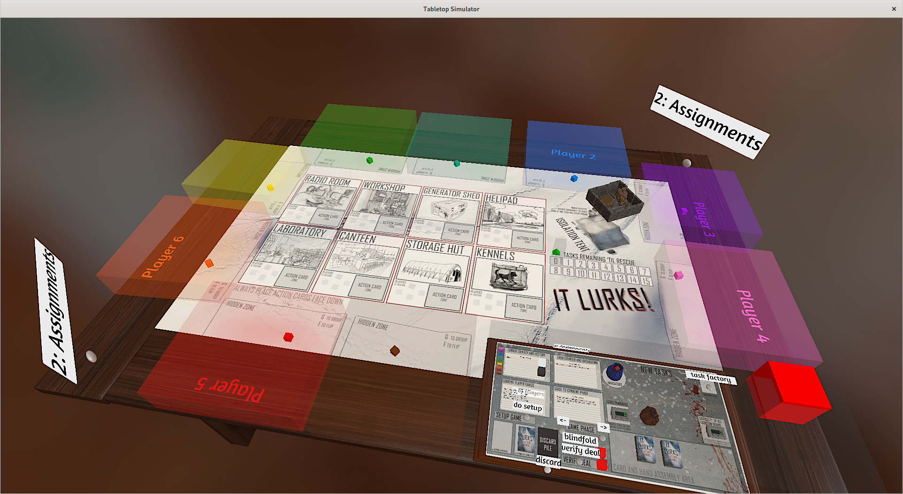

# Table of Contents

1.  [Run requirements](#orgcb06394)
2.  [How to run the game](#org39f6d65)
3.  [How to play the game](#org1af43c9)
4.  [How to build the code](#orgfeee733)

This is a prototype of a party-game created by a friend during the first COVID
lockdown of March 2020. It was created in order to support remote playtesting,
although the game itself is probably better played in person.

# Run requirements

-   A working installation of [tabletop simulator](https://www.tabletopsimulator.com/)

# How to run the game

The game was implemented as a [tabletop simulator](https://www.tabletopsimulator.com/) image. A curiosity of tabletop
simulator is its dense integration of scripts with its “saved games,” which
faintly resemble the [smalltalk](https://pharo.org/) virtual machines I had started playing with, out
of curiosity, in early 2020. In effect, a “game” implemented for tabletop
simulator is actually a complete record of an initial state of a huge pile of
virtual assets, entities which (for a beginner like me) have to be manually
distributed across a virtual tabletop. Each asset has an ID, and it’s possible
to write scripts which refer to these IDs and create additional behaviours for
them, building on the basis of the very rich and enjoyable built-in tabletop
simulator [api](file:///api.tabletopsimulator.com/).

What that means is there’s no direct way to run the code in this folder! First
you need to install the virtual machine - that is, you need to buy Tabletop
Simulator - then you need to copy the image, `tts-images/TS_Save_5.json` (and
perhaps also its snapshot `tts-images/TS_Save_5.png`) into the `Saves` folder of
your `tabletop simulator` installation - then you’ll be able to load the save
from the in-game “Load/Save” interface.

# How to play the game

The minimum number of players is 6: 5 players and one game-master (playing
black).

This was built as an in-house prototype, so although the game is playable, it’s
not fully documented! Version 1 of the rulebook can be found in the `docs`
folder; it describes the game as played in-person.

The game interface itself isn’t documented, but is quite discoverable. If any
interest arises I’ll be happy to provide some guidance.

# How to build the code

I’ve actually, after two years, forgotten! There are some references to
[LUAbundler](https://github.com/Benjamin-Dobell/luabundler) in the code, but I think I must have been using something devoted to
tabletop simulator; maybe the [official Atom plugin](https://api.tabletopsimulator.com/atom/) or the [unofficia VSCode
plugin](https://marketplace.visualstudio.com/items?itemName=rolandostar.tabletopsimulator-lua), or some combination of them.

Having forgotten is a good reminder to take better notes on how these things are
done when they’re being done…

